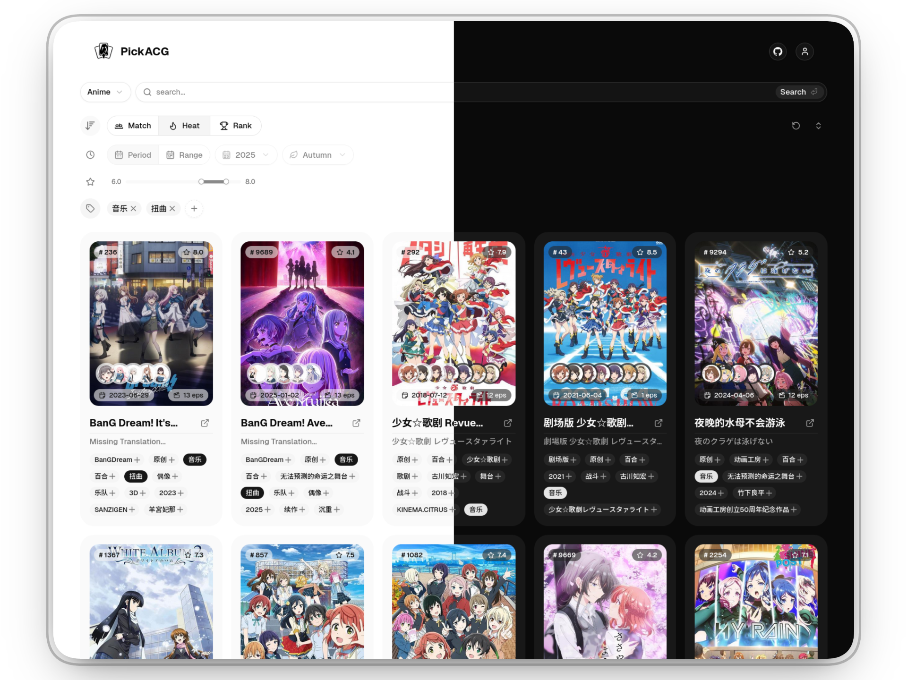

<div align="center">


# PickACG

**基于 Bangumi API 的现代化 ACG 内容探索平台**

**简体中文** | [English](./README.en.md)

[![DeepWiki](https://img.shields.io/badge/-ask_DeepWiki-blue.svg?style=flat-square&labelColor=black&logo=data:image/png;base64,iVBORw0KGgoAAAANSUhEUgAAACwAAAAyCAYAAAAnWDnqAAAAAXNSR0IArs4c6QAAA05JREFUaEPtmUtyEzEQhtWTQyQLHNak2AB7ZnyXZMEjXMGeK/AIi+QuHrMnbChYY7MIh8g01fJoopFb0uhhEqqcbWTp06/uv1saEDv4O3n3dV60RfP947Mm9/SQc0ICFQgzfc4CYZoTPAswgSJCCUJUnAAoRHOAUOcATwbmVLWdGoH//PB8mnKqScAhsD0kYP3j/Yt5LPQe2KvcXmGvRHcDnpxfL2zOYJ1mFwrryWTz0advv1Ut4CJgf5uhDuDj5eUcAUoahrdY/56ebRWeraTjMt/00Sh3UDtjgHtQNHwcRGOC98BJEAEymycmYcWwOprTgcB6VZ5JK5TAJ+fXGLBm3FDAmn6oPPjR4rKCAoJCal2eAiQp2x0vxTPB3ALO2CRkwmDy5WohzBDwSEFKRwPbknEggCPB/imwrycgxX2NzoMCHhPkDwqYMr9tRcP5qNrMZHkVnOjRMWwLCcr8ohBVb1OMjxLwGCvjTikrsBOiA6fNyCrm8V1rP93iVPpwaE+gO0SsWmPiXB+jikdf6SizrT5qKasx5j8ABbHpFTx+vFXp9EnYQmLx02h1QTTrl6eDqxLnGjporxl3NL3agEvXdT0WmEost648sQOYAeJS9Q7bfUVoMGnjo4AZdUMQku50McDcMWcBPvr0SzbTAFDfvJqwLzgxwATnCgnp4wDl6Aa+Ax283gghmj+vj7feE2KBBRMW3FzOpLOADl0Isb5587h/U4gGvkt5v60Z1VLG8BhYjbzRwyQZemwAd6cCR5/XFWLYZRIMpX39AR0tjaGGiGzLVyhse5C9RKC6ai42ppWPKiBagOvaYk8lO7DajerabOZP46Lby5wKjw1HCRx7p9sVMOWGzb/vA1hwiWc6jm3MvQDTogQkiqIhJV0nBQBTU+3okKCFDy9WwferkHjtxib7t3xIUQtHxnIwtx4mpg26/HfwVNVDb4oI9RHmx5WGelRVlrtiw43zboCLaxv46AZeB3IlTkwouebTr1y2NjSpHz68WNFjHvupy3q8TFn3Hos2IAk4Ju5dCo8B3wP7VPr/FGaKiG+T+v+TQqIrOqMTL1VdWV1DdmcbO8KXBz6esmYWYKPwDL5b5FA1a0hwapHiom0r/cKaoqr+27/XcrS5UwSMbQAAAABJRU5ErkJggg==)](https://deepwiki.com/Ezer015/pickacg)
[](https://pickacg.ezers.top/)
[](./LICENSE)



[](https://pickacg.ezers.top/)

</div>

## ✨ 主要特性

- 🔍 **智能标签系统**：基于搜索结果动态聚合标签，支持多标签组合过滤，精准定位兴趣点。
- 📊 **多维筛选机制**：支持按评分区间、放送日期、热度等进行深度筛选。
- 📱 **全平台适配**：基于响应式设计，完美适配桌面端与移动端，支持深色/浅色模式自动切换。
- 🔐 **个性化体验**：集成 Bangumi OAuth 2.0，登录后解锁更多内容。
- ⚡ **极致性能**：采用 Next.js App Router 与无限滚动加载技术，浏览体验丝滑。
- 🎨 **现代 UI**：使用 shadcn/ui 构建，界面简洁优雅。

## 🚀 快速开始

### 克隆仓库

```bash
git clone https://github.com/Ezer015/pickacg.git
cd pickacg
```

### 安装依赖

```bash
pnpm install
```

### 启动开发服务器

```bash
pnpm dev
```

访问 [http://localhost:3000](http://localhost:3000) 即可开始开发。

## 📦 构建部署

### 生产环境构建

```bash
pnpm build
pnpm start
```

### 部署到 Vercel

[](https://vercel.com/new/clone?repository-url=https://github.com/Ezer015/pickacg)

## 🤝 参与贡献

欢迎提交 Issue 和 Pull Request！

1. Fork 本仓库
2. 创建您的特性分支 `git checkout -b feature/amazing-feature`
3. 提交您的修改 `git commit -m 'feat: add some amazing feature'`
4. 推送到分支 `git push origin feature/amazing-feature`
5. 打开一个 Pull Request

## 📄 许可证

本项目基于 [GNU AGPL v3.0](./LICENSE) 开源许可证发布。

## 🙏 致谢

- [Bangumi API](https://github.com/bangumi/api)
