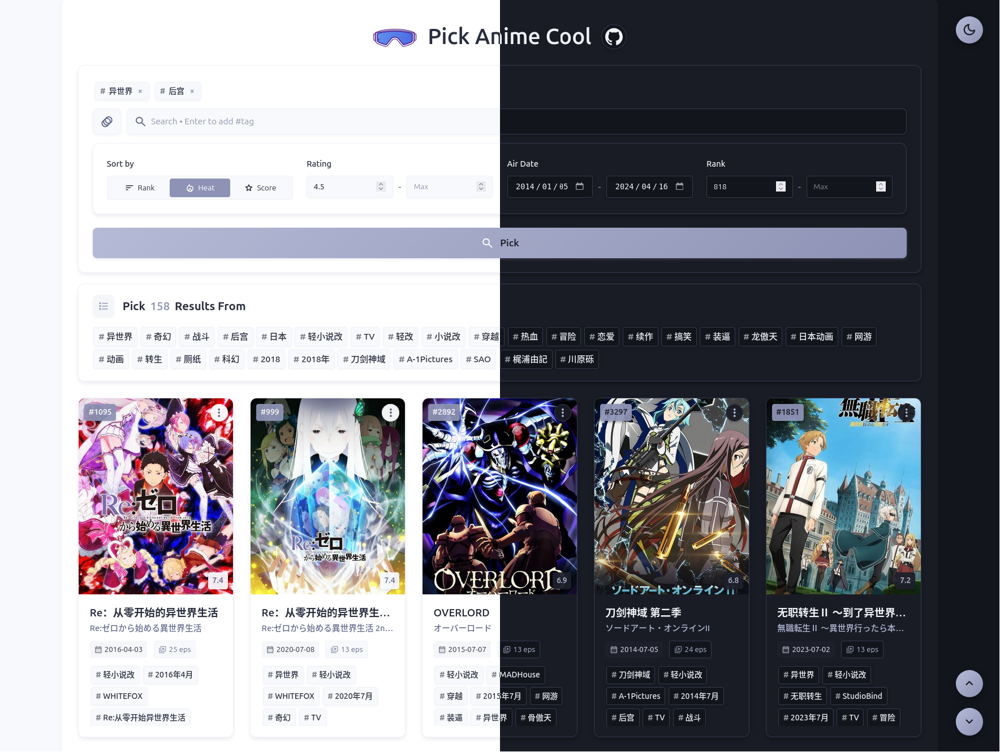

<div align="center">


# Pick Anime Cool

  基于 Bangumi API 开发的高效多标签番剧搜索界面

**简体中文** | [English](./docs/README.en.md)

[](https://ezer015.github.io/pick-anime-cool/)
[](./LICENSE)




> Pick Anime Cool 通过组合筛选标签、评分和排名，帮你找到想看的动画。

</div>

## 🌟 主要特性

### 🎯 多标签搜索系统

- 基于搜索结果的智能标签建议
- 组合多个标签实现精确过滤
- 交互式标签管理界面

### 📊 高级筛选

- 基于评分的筛选
- 放送日期筛选
- 基于排名的筛选
- 按排名、人气或评分排序
- 内容类型选择（动画、书籍、音乐、游戏、三次元）

### 🎨 用户体验

- 适配所有设备的响应式设计
- 明暗主题切换
- 无限滚动加载
- 快速导航按钮
- 标题复制的快捷菜单

## 🚀 快速开始

### 在线使用

1. 立即体验：[在线演示](https://ezer015.github.io/pick-anime-cool/)
2. 选择内容类型
3. 输入关键词搜索（或留空显示全部）
4. 点击推荐标签或动画卡片上的标签
5. 使用筛选器调整搜索结果

### 本地开发

```bash
# 克隆仓库
git clone https://github.com/ezer015/pick-anime-cool.git

# 进入项目目录
cd pick-anime-cool

# 启动本地服务器（Python示例）
python -m http.server

# 在浏览器中访问
open http://localhost:8000
```

## 🛠️ 技术细节

### 架构

```
src/
├── js/
│   └── anime_search.js    # 核心搜索功能
└── styles/
    ├── base.css          # 基础样式和重置
    ├── components.css    # UI组件
    ├── main.css         # 主应用样式
    └── utilities.css    # 实用工具类
```

### 技术栈

- 🌐 原生 JavaScript (ES6+)
- 🎨 使用自定义属性的 CSS3
- 📱 响应式 HTML5
- 🔌 Bangumi API v0 集成

### API 集成

- 端点：`POST /v0/search/subjects`
- 功能：
  - 高级筛选
  - 自定义排序
  - 分页支持
  - 错误处理
  - CORS 兼容

## 📄 许可证

本项目基于 [GNU AGPL v3.0](./LICENSE) 开源许可证发布。

## 🙏 致谢

- [Bangumi API](https://bangumi.github.io/api/) - 提供全面的动画数据
